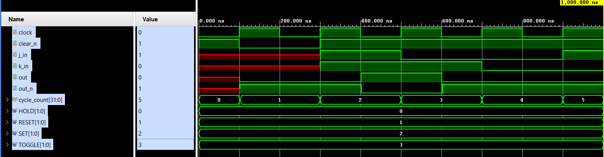
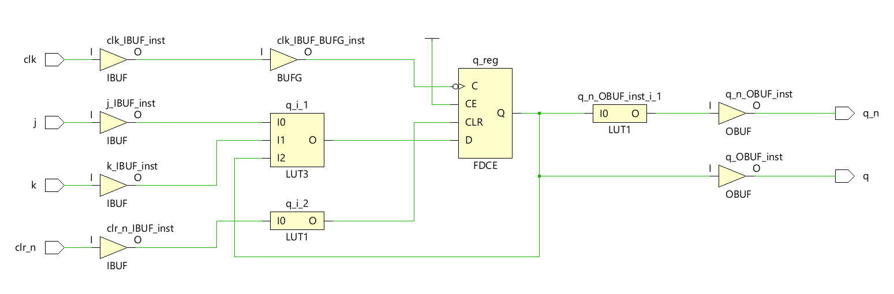

# 🔁 JK Flip-Flop – Behavioral vs Synthesizable Verilog Design

## 📚 Description

This project implements a **JK Flip-Flop** using two modeling styles in Verilog:

- 🧠 **Behavioral Modeling (`jk_beh.v`)** – For simulation and learning purposes
- ⚙️ **RTL Modeling (`jk_rtl.v`)** – Synthesizable and hardware-friendly

Testbench (`tb_jk.v`) is used to verify both models via **Vivado simulations**. Output waveforms and schematics help analyze behavior and synthesis readiness.

---

## 🔧 Files Included

| File              | Description                             |
|-------------------|-----------------------------------------|
| `jk_beh.v`        | Behavioral (non-synthesizable) Verilog  |
| `jk_rtl.v`        | RTL (synthesizable) Verilog             |
| `tb_jk.v`         | Testbench for both models               |
| `waveform_*.png`  | Vivado simulation output                |
| `schematic_*.png` | RTL schematic from Vivado               |

---

## 🧪 Simulation Results

### ✅ Behavioral Model – Waveform

> **Interpretation**: Behavioral modeling captures abstract control logic, suitable for quick simulation but may not synthesize.
> Minimal or incorrect synthesis result – highlights non-synthesizable constructs like `assign` to `reg`.

### ✅ RTL Model – Waveform

> **Interpretation**: RTL model aligns with clock-triggered flip-flop behavior, enabling accurate timing and synthesis.

---

## 🧩 RTL Schematic Views

### 🔬 RTL Schematic (from Vivado)

> Real flip-flop structure visible – confirms synthesis compatibility.

### 🧮 Gate Level Schematic

> Synthesized Gate Level schematic consisting of buffers, LUTs , reg etc.

---

## 📌 Major Learnings

### ✅ Synthesizable vs Non-Synthesizable Modeling in Verilog

| Concept                  | Behavioral (`jk_beh.v`)              | RTL (`jk_rtl.v`)                    |
|--------------------------|--------------------------------------|-------------------------------------|
| Reset Handling           | `assign/deassign` (non-synthesizable) | Async reset using `if (!rst)` logic |
| Output Drive             | `assign` on `reg`                    | Procedural `always` block           |
| Synthesis Result         | Fails or gives warning               | Clean RTL schematic                 |
| Use Case                 | Functional simulation only           | Simulation + Synthesis              |

**💡 Key Insight**:  
If you **cannot represent it with gates or flip-flops**, it is *not synthesizable*. Behavioral constructs (like `assign` to a `reg`, or `deassign`) are simulation-only and **do not map to real hardware**. RTL modeling uses only `always` blocks and conditional logic – matching real hardware behavior.

---

## 🔍 Tools Used

- 🛠️ Vivado 2023.x
- 🧪 Verilog Simulation
- 📉 Timing-aware RTL Schematic
- 💡 Synthesizability Analysis

---

## 📌 Skills & Industry Alignment

- ✅ Clarity on HDL modeling levels (Behavioral vs RTL)
- ✅ Hands-on Vivado usage for simulation and synthesis
- ✅ Awareness of hardware-mappable logic constructs
- ✅ GitHub-based presentation for visibility and portfolio

---

## 📁 Future Scope

- 🔄 Extend with **D, T, and SR Flip-Flops**
- 🧠 Add **state machines (FSMs)** using synthesizable RTL
- 📈 Include **timing analysis reports** (Slack, setup/hold)
- 📂 Build a **Modular Digital Blocks Library**

---

## 📬 Connect With Me

I'm an aspiring VLSI engineer documenting my learning journey for deeper understanding and job readiness. Connect or give feedback!

📌 [LinkedIn](https://linkedin.com/in/pranav-indurkar213)  
📧 pranavindurkar111@gmail.com  

