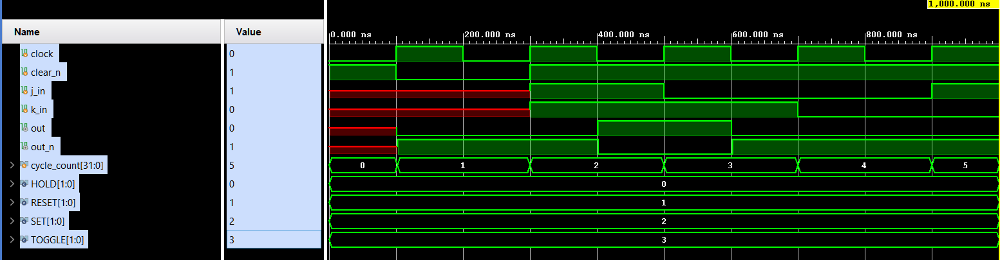
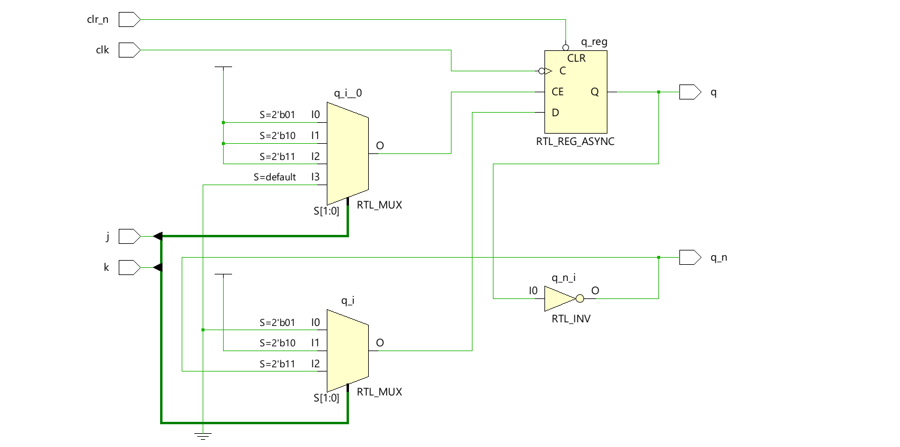
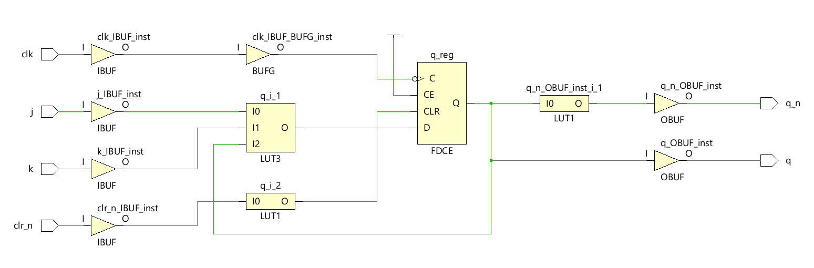

# 🔁 JK Flip-Flop – Behavioral vs Synthesizable Verilog Design

## 📚 Important Theory
- The Popular, 7473 IC, which contains two JK flip-flops, is typically clocked on the falling edge of the clock signal.
- Specifically, the 7473 is a negative-edge-triggered flip-flop. This means that the flip-flop latches the input data when the clock signal goes from a high voltage to a low voltage.
- The J and K inputs must be stable for a certain setup time before the falling edge for predictable operation.
- The 7473 is also a master-slave flip-flop. This means that the input data is first loaded into a "master" latch while the clock is high, and then transferred to the "slave" latch (which outputs the data) on the falling edge of the clock.
- The original advantage of a J-K flip-flop is its high functionality combined with small package and low pin count.

## 📚 Important Note regarding Behavioral modeling of JK Flipflop
- Note that the asynchronous clear input is implemented such that once the clear is asserted, the output is forced low until the clear is deasserted. This eliminates the need to test the clear input on each clock cycle during the next always block, reducing the number of instructions that need to be executed each clock cycle. Anything that reduces instructions per clock cycle will speed up the simulation significantly. This works fine for behavioral code, and some synthesis tools can recognize this construct, but most don’t.
## 📚 Important Note regarding RTL modeling of JK Flipflop
- Note that the asynchronous clear signal is implemented such that even after the clear is asserted, the always block is evaluated on each falling clock edge. This increases the simulation time, but allows the synthesis tool to see that both falling edges of the clock and the clear cause immediate changes to the state of the hardware.There is a potential problem with simulating a synthesized, gate-level J-K flip-flop and many devices like it. The problem can cause undefined signals to propagate throughout the design.

## 📚 Description

This project implements a **JK Flip-Flop** using two modeling styles in Verilog:

- 🧠 **Behavioral Modeling (`jk_beh.v`)** – For simulation and learning purposes
- ⚙️ **RTL Modeling (`jk_rtl.v`)** – Synthesizable and hardware-friendly

Testbench (`tb_jk.v`) is used to verify both models via **Vivado simulations**. Output waveforms and schematics help analyze behavior and synthesis readiness.

---

## 🔧 Files Included

| File              | Description                             |
|-------------------|-----------------------------------------|
| `jk_beh.v`        | Behavioral (non-synthesizable) Verilog  |
| `jk_rtl.v`        | RTL (synthesizable) Verilog             |
| `tb_jk.v`         | Testbench for both models               |
| `waveform_*.png`  | Vivado simulation output                |
| `schematic_*.png` | RTL schematic from Vivado               |

---

## 🧪 Simulation Results

### ✅ Behavioral Model – Waveform

> **Interpretation**: Behavioral modeling captures abstract control logic, suitable for quick simulation but may not synthesize.
> Minimal or incorrect synthesis result – highlights non-synthesizable constructs like `assign` to `reg`.

### ✅ RTL Model – Waveform

> **Interpretation**: RTL model aligns with clock-triggered flip-flop behavior, enabling accurate timing and synthesis.

---

## 🧩 RTL Schematic Views

### 🔬 RTL Schematic (from Vivado)

> Real flip-flop structure visible – confirms synthesis compatibility.

### 🧮 Gate Level Schematic

> Synthesized Gate Level schematic consisting of buffers, LUTs , reg etc.

---

## 📌 Major Learnings

### ✅ Synthesizable vs Non-Synthesizable Modeling in Verilog

| Concept                  | Behavioral (`jk_beh.v`)              | RTL (`jk_rtl.v`)                    |
|--------------------------|--------------------------------------|-------------------------------------|
| Reset Handling           | `assign/deassign` (non-synthesizable) | Async reset using `if (!rst)` logic |
| Output Drive             | `assign` on `reg`                    | Procedural `always` block           |
| Synthesis Result         | Fails or gives warning               | Clean RTL schematic                 |
| Use Case                 | Functional simulation only           | Simulation + Synthesis              |

**💡 Key Insight**:  
If you **cannot represent it with gates or flip-flops**, it is *not synthesizable*. Behavioral constructs (like `assign` to a `reg`, or `deassign`) are simulation-only and **do not map to real hardware**. RTL modeling uses only `always` blocks and conditional logic – matching real hardware behavior.

